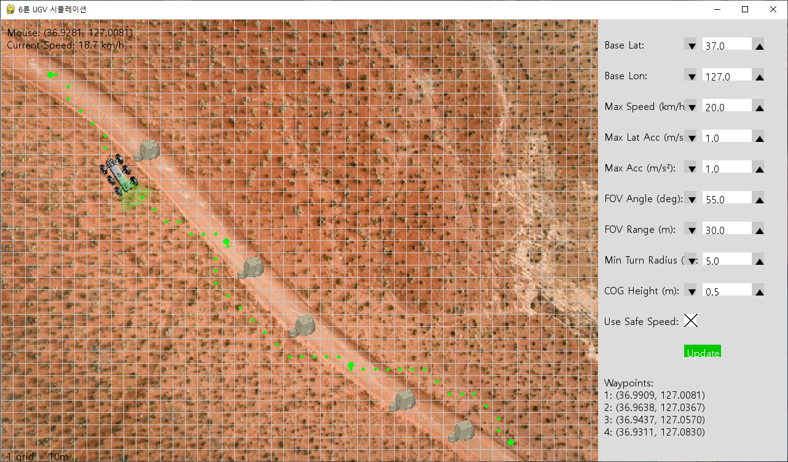
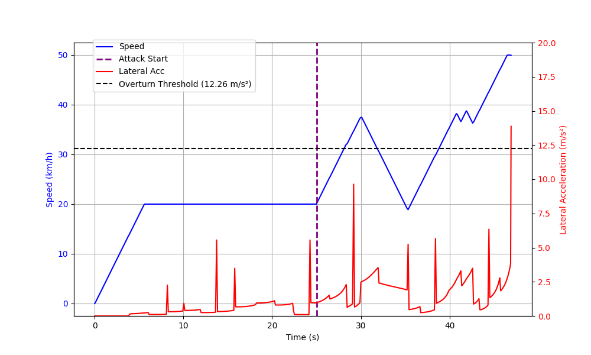

# Engagement-Level-UGV-Simulator
Engagement-level UGV Simulator for Cyber Mission Assessment

**KCC 2025 Best Paper Award Winner**

- Integrated 3-DOF UGV dynamics
- Applied A* algorithm for obstacle avoidance and path tracking
- Enabled mission impact analysis of UGV under cyber effects

- Simulator Execution Screen  
  

- Simulation Results  
  
